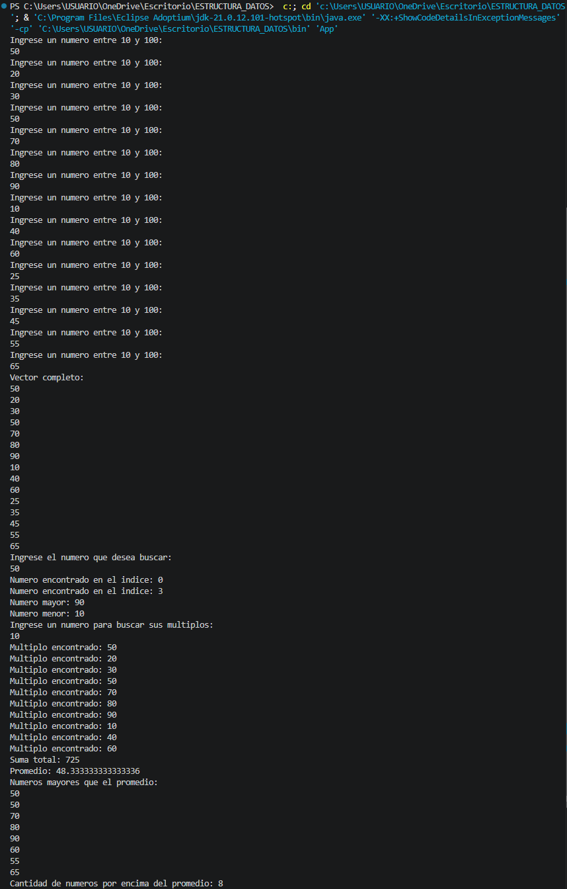

# Estructura de Datos - Vectores en Java

## Objetivo

Practicar operaciones con vectores de números enteros en Java mediante la búsqueda de valores, determinación del mayor y menor, identificación de múltiplos, cálculo de la suma, cálculo del promedio y creación de un nuevo vector con los valores superiores al promedio.

## Descripción del proyecto

Este programa trabaja con un vector de 15 números enteros y permite realizar las siguientes operaciones:

1. Crear y llenar un vector de 15 números enteros.
2. Validar que los números ingresados estén entre 10 y 100.
3. Buscar un número dentro del vector y mostrar los índices donde se encuentra.
4. Determinar el número mayor y el número menor.
5. Identificar los múltiplos de un número ingresado por el usuario.
6. Calcular la suma de todos los valores del vector.
7. Calcular el promedio de los valores.
8. Crear un nuevo vector con los números mayores que el promedio.
9. Mostrar la cantidad de números que están por encima del promedio.

## Tecnologías utilizadas

- Java
- JDK Eclipse Temurin 21
- Visual Studio Code

## Evidencias

### Capturas de pantalla de la consola

A continuación se muestra la ejecución del programa y el resultado de los puntos solicitados:

### Video de sustentación

Enlace al video:

**Pendiente de agregar**

## Repositorio de GitHub

Repositorio público:

https://github.com/J4nus29/ESTRUCTURA-DE-DATOS
